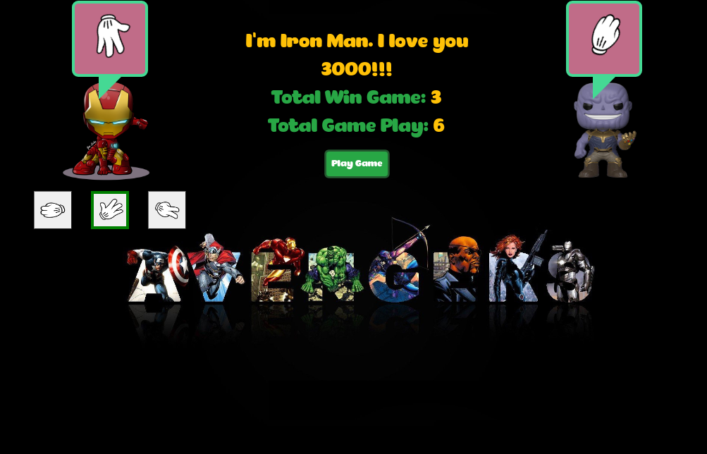

# Getting Started with Create React App

This project was bootstrapped with [Create React App](https://github.com/facebook/create-react-app).

## Project Description

This is a redux project about rock paper scissors game. The player will choose from three game items rock, paper, or scissors. The computer will randomly chooose one game item.

## Available Scripts

In the project directory, you can run:

### `yarn start`

Runs the app in the development mode.\
Open [http://localhost:3000](http://localhost:3000) to view it in the browser.

## Project View

